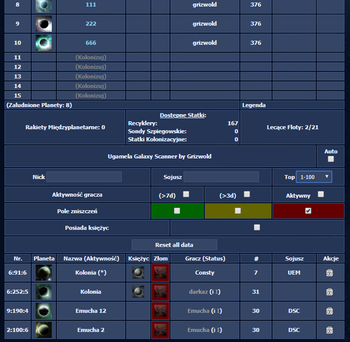

# Ugamela Galaxy scanner

Skrypt instalowany przez Tampermonkey/Greasemonkey.

## Funkcjonalności
 - [x] Zapisywanie widzianych wcześniej stron układu
 - [x] Automatyczne przechodzenie przez całe galaktyki w celu zapisania układu planet
 
 
 - [x] Wyszukiwarka planet danego gracza
 - [x] Wyszukiwarka planet danego sojuszu
 - [x] Wyszukiwarka graczy na podstawie aktywności
 - [x] Wyszukiwarka graczy na podstawie rankingu
 - [ ] Wyszukiwarka graczy na podstawie odległości
 - [x] Wyszukiwarka Pól zniszczeń
 - [x] Wyszukiwarka księżyców
 
## Wygląd

